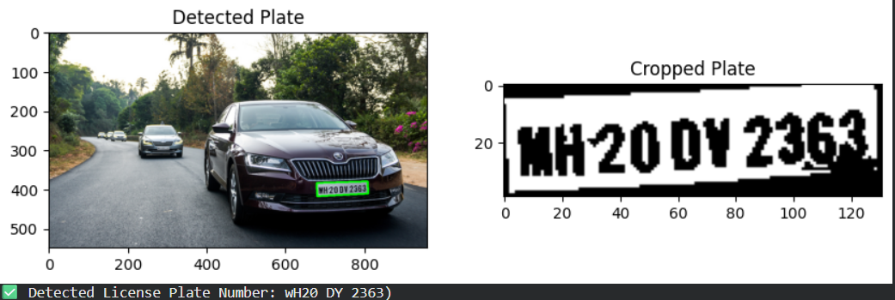

# License Plate Recognition using Image Processing

## Introduction

This project focuses on detecting and recognizing vehicle license plates using Digital Image Processing techniques and Optical Character Recognition (OCR). It is implemented using Python, OpenCV, and Tesseract OCR.

## Methodology

The system follows these steps:

1. Image Acquisition
2. Grayscale Conversion
3. Noise Reduction (Bilateral Filtering)
4. Edge Detection (Canny Algorithm)
5. Contour Detection
6. License Plate Extraction
7. Text Recognition using OCR

## Code

The implementation is done using Python with OpenCV and Tesseract OCR. The code performs image preprocessing, detects the license plate region, and extracts text from it.

## Code Explanation

* OpenCV is used for image processing tasks
* Canny Edge Detection helps detect edges
* Contours help locate the plate region
* Tesseract OCR extracts text from the image

## Applications

* Traffic Monitoring Systems
* Automated Toll Collection
* Parking Management Systems
* Security and Surveillance

## Output

Detected License Plate Number:
MH20 DY 2363

## Conclusion

The project successfully detects and recognizes license plates from vehicle images. It performs well on clear images and demonstrates real-world applications. Future improvements can include deep learning-based detection for better accuracy.

## References

* OpenCV Documentation
* Tesseract OCR Documentation
* Research papers on License Plate Recognition

## Author

K M Shamsul Fahad
